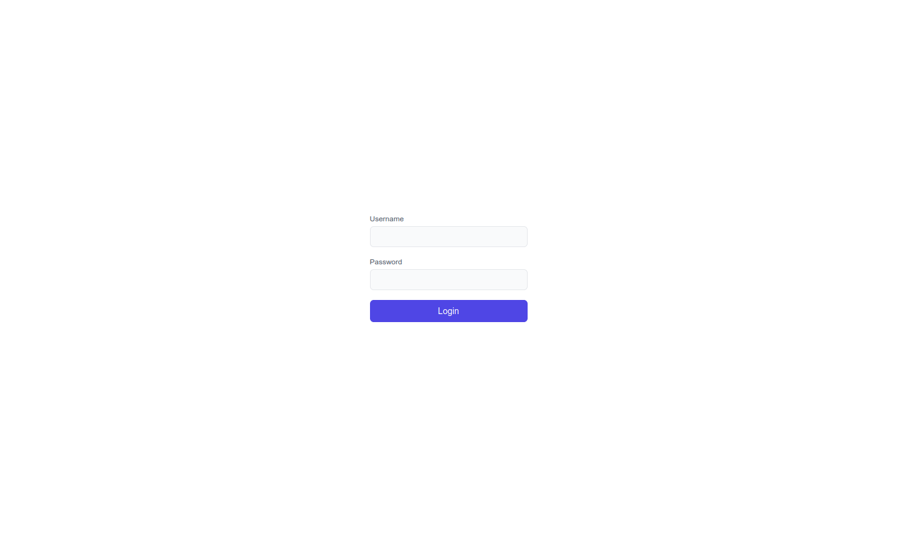
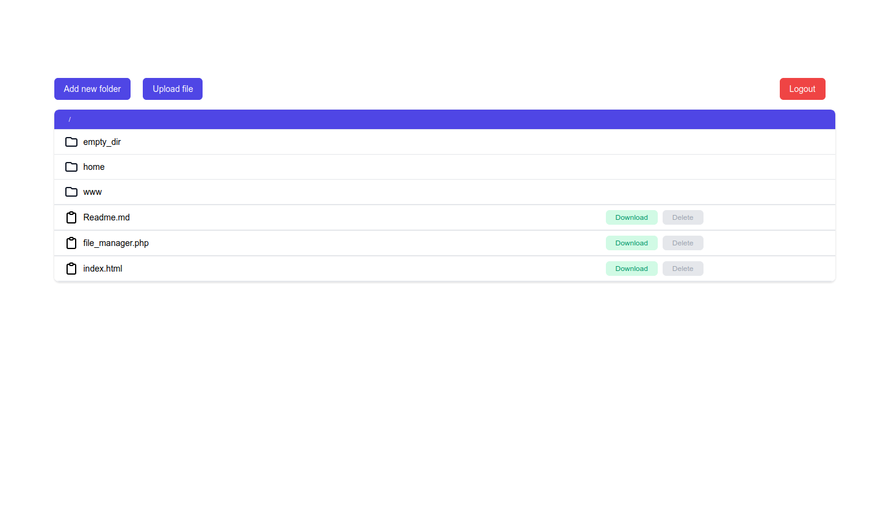
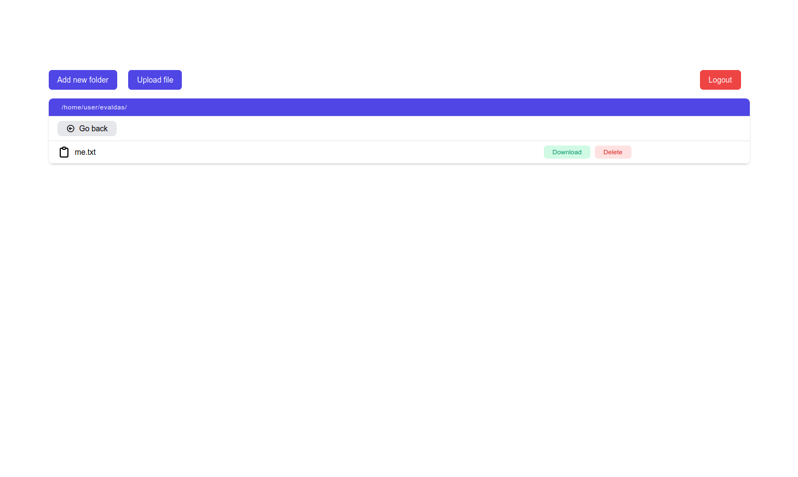
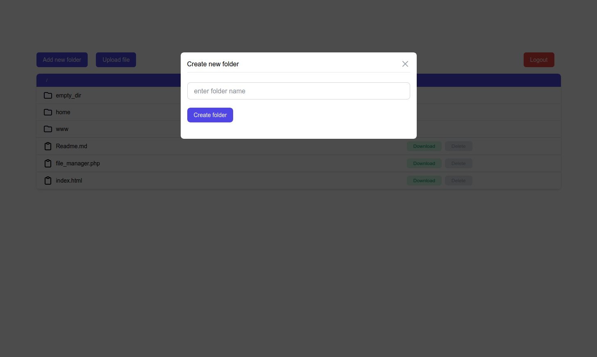
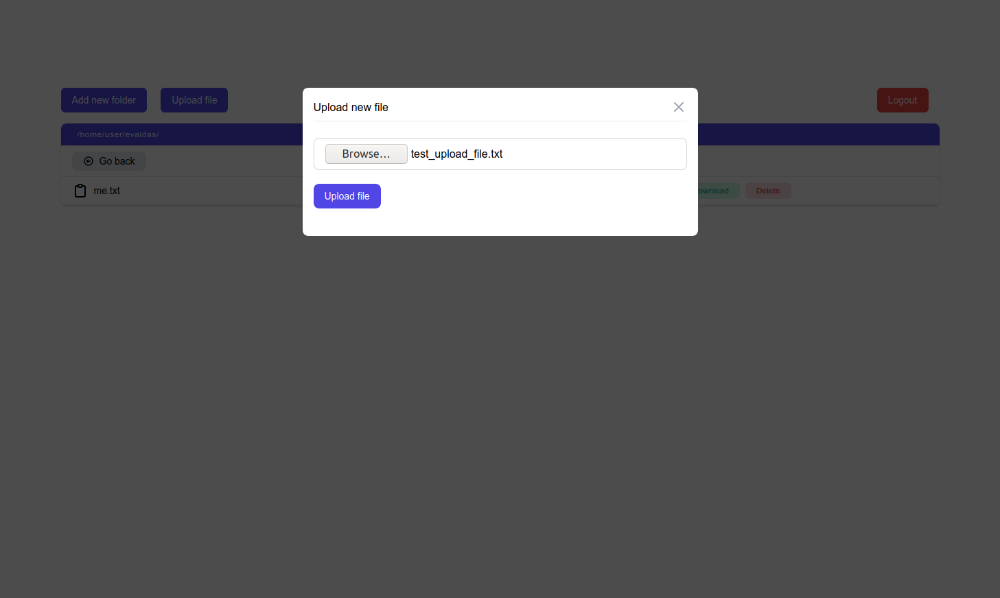

## File explorer SPA

Server file explorer built with PHP and JavaScript

### Requirements

Functionality that must be implemented by objective requirements.

 - :heavy_check_mark: User can see list of files inside directory
 - :heavy_check_mark: User can see list of folders inside directory
 - :heavy_check_mark: User can move between folders
 - :heavy_check_mark: User can create new folder
 - :heavy_check_mark: User can delete file
 - :heavy_check_mark: User can upload new file
 - :heavy_check_mark: User can download file
 - :heavy_check_mark: Fake authorization


### Login details

- username: **user**
- password: **secret**

### Installation

- if php installed locally

```bash

# clone project
git@github.com:EvaldasBurlingis/BIT-PHP-file-explorer

# cd into it
cd BIT-PHP-file-explorer

# run local server
php -S localhost:8000 


```

- Using server

```bash

# clone project 
git@github.com:EvaldasBurlingis/BIT-PHP-file-explorer

# run server and open your specified url

```

### Screenshots

<div>
    
    
    
    
    
</div>